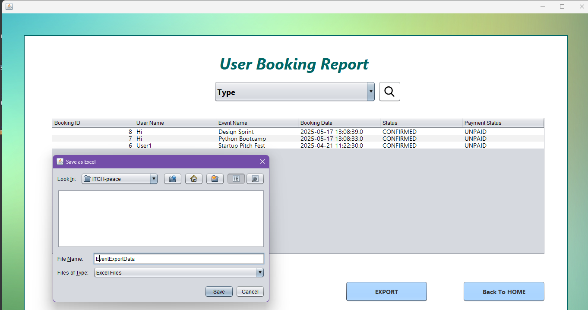

# EventEase

# 📅 EventEase – Academic & Cultural Event Scheduler

## 🏷️ Project Domain:
**Education – Event Scheduling**

---

## 🖼️ Screenshots

| Main Dashboard | Description |
| -------------- | ----------- |
|  | **Figure 1:** The admin dashboard showing the different functionalities. |
|  | **Figure 2:** The event booking showing the event list with filters, seat‑availability badges, and the “Export to Excel†button in the toolbar. |

---

## 📌 Abstract

Universities often conduct events like hackathons, quizzes, workshops, and fests, but the lack of a centralized, efficient system leads to mismanagement of registrations, seat allocations, and notifications.

**EventEase** is a **Java desktop-based Event Management System** built using **Swing & AWT** for the GUI and **MySQL** for backend storage. It streamlines scheduling, seat booking, and communication between students, faculty, and admins.

---

## 🎯 Project Objectives

- 🔐 **User & Admin Authentication**  
  Role-based login/signup functionality.

- 🗓️ **Event Management**  
  Admins can add, edit, delete, and list events (e.g., Hackathons, Competitions, Fests).

- 💺 **Seat Booking System**  
  Users can check availability and register for events.

- 🙍‍♂️ **Profile Management**  
  Users can update their name, password, profile picture, and other details.

- 🖥️ **User Interface (GUI)**  
  Built with Java Swing & AWT for a smooth user experience.

- 💾 **Database Connectivity**  
  JDBC is used to connect Java with MySQL for managing events, users, and bookings.

- 📝 **Feedback System**  
  Students and faculty can submit complaints or feedback for events.

- 🔍 **Event Filters & Listings**  
  Search and filter events by type, date, or department.
- 📤 **Data Export**
  Admins can export event booking tables to Excel (and later PDF) for quick reporting. 

---

## 💡 Technologies Used

### 🧰 Java Features
- Java Swing & AWT – for GUI
- JDBC (java.sql) – for database operations
- MySQL – to store event and user data

### 📚 Libraries & APIs
- **JDBC Driver** – For MySQL connection
- **JCalendar** – Calendar component for date selection
- **Apache POI (Optional)** – For exporting reports (Excel/PDF)
- **QR Code Generator (Optional)** – For event entry passes
- **Apache POI** – Generates Excel files for the new export‑to‑Excel feature.

---

## 🗃️ Database Overview

- **Users Table:** Stores student/faculty profiles
- **Events Table:** Details about each scheduled event
- **Bookings Table:** Links users to the events they've registered for
- **Feedback Table:** Collects complaints or suggestions

---

## 🚀 How to Run

1. Clone or download the project.
2. Open the project in **NetBeans** or **VS Code**.
3. Connect to your **MySQL database** and import the SQL schema.
4. Add JDBC library to your project.
5. Compile and run the application using your IDE.

---

## 📌 Note

This project was developed as part of an academic mini-project for learning purposes. Future improvements may include:
- QR Code-based entry
- Email/SMS notifications
- Admin dashboard with analytics

---

## Created with ❤️ by Riya 

--- 

